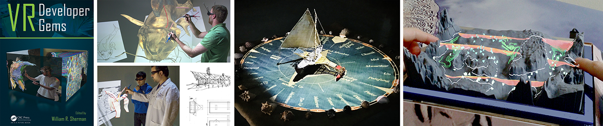

### MinVR3 Unity Package

This is the 3rd incarnation of "MinVR", a VR (really XR) open source toolkit designed to support research in XR, spatial user interfaces, pen and touch interfaces, and 3D data visualization.  MinVR3 has been developed by the University of Minnesota's [Interactive Visualization Lab](https://ivlab.cs.umn.edu/), building upon collaborations in past MinVRs with Brown University and Macalester College.

### Getting Started
* Follow the [Installation Guide](manual/install.md) to incorporate MinVR3 into your project.  Pay attention to the [Optional Packages](manual/install.md#optional-packages) section to only install the packages you require for your XR setup.
* [Package introduction / overview](manual/intro.md)
* [Key classes organized by theme / functionality](api/index.md)
* Read about [Concept 1](manual/concept1.md)
* Read about [Concept 2](manual/concept2.md)
