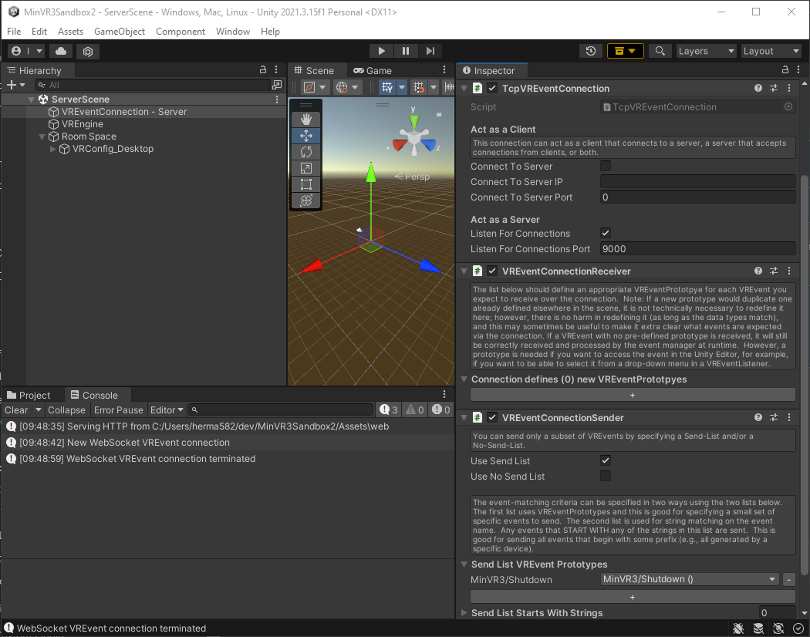
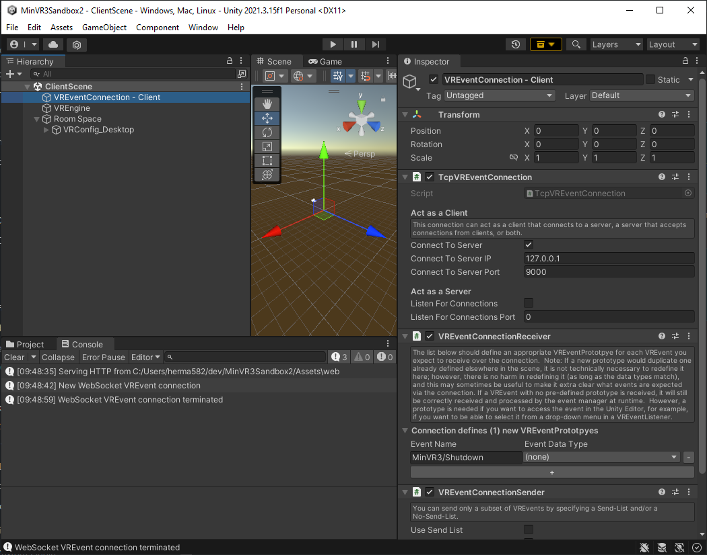

# Remote Connections

MinVR apps can communicate with remote applications or services by sending
VREvents across the network.  This can be done in two different modes.  Remote
Connections (described on this page) are for situations where the goal is to
pass messages or data.  VREvents are also shared across the network when running
MinVR in a [cluster mode](16-cluster.md), but this is for strict frame-level
synchronization on multiple machines that are connected on a fast, local network
to render on tiled displays.

## Supported connections

MinVR3 supports networked interoperability between Unity applications, and even
other languages. The following connection types are supported:

- Unity &lrarr; Unity
- Unity &lrarr; C++ (via MinVR3.cpp~)
- Unity &lrarr; JavaScript (via MinVR3.js~)
- Unity &lrarr; Python (via MinVR3.py~)

## Getting started with remote connections

In general, you need up to three components in your Unity scene to make remote
connections work:

1. A VR Event Connection that actually transmits data over the network (generally different for each language client, some of the available ones are listed below)
    - @IVLab.MinVR3.TcpJsonVREventConnection - transmits VREvents as JSON strings over a TCP socket (this is a good default for Unity &lrarr; Unity communication, and other languages like Python and C++)
    - @IVLab.MinVR3.TcpVREventConnection - transmits VREvents as binary over a TCP socket (this is good for Unity &lrarr; Unity communication if you need it to be faster than JSON [has not actually been proven to be faster])
    - `HttpWebSocketVREventConnection` (via the [MinVR3 WebSocket plugin](https://github.umn.edu/ivlab-cs/MinVR3Plugin-WebSocket)) - transmits VREvents by WebSocket (best for communicating with browsers where the webpage itself is served from Unity)
2. A @IVLab.MinVR3.VREventConnectionReceiver component (receives specified events from the remote connection and adds them to MinVR3's event queue)
3. A @IVLab.MinVR3.VREventConnectionSender component (sends specified events from MinVR3's event queue to the remote connection)

For example, if you want to have two Unity apps communicate with one another,
use a setup like this (this just sends a "Shutdown" event when the server is
done running):

App 1 (Server):

Under a GameObject named "VREventConnection - Server":

- @IVLab.MinVR3.TcpJsonVREventConnection
    - act as server, listen for connections
    - listen for connections on port 9000
- @IVLab.MinVR3.VREventConnectionReceiver
    - optional in server - server doesn't need to listen for anything in this test app
- @IVLab.MinVR3.VREventConnectionSender
    - use send list
    - send the `MinVR3/Shutdown` event

App 2 (Client):

Under a GameObject named "VREventConnection - Client":

- @IVLab.MinVR3.TcpJsonVREventConnection
    - act as client, connect to server
    - connect to server `127.0.0.1` (localhost)
    - connect to server port 9000
- @IVLab.MinVR3.VREventConnectionReceiver
    - Add a new event `MinVR3/Shutdown`
- @IVLab.MinVR3.VREventConnectionSender
    - optional in client - client doesn't need to send anything in this app

