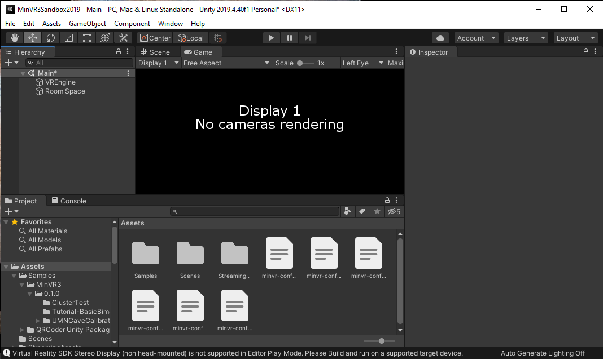
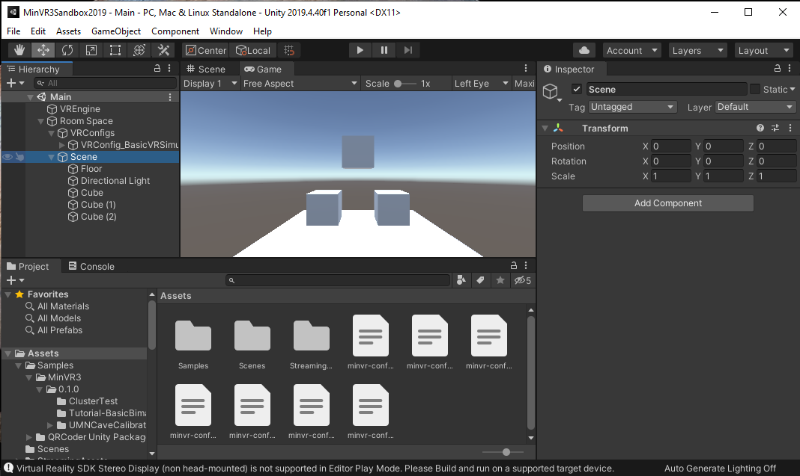
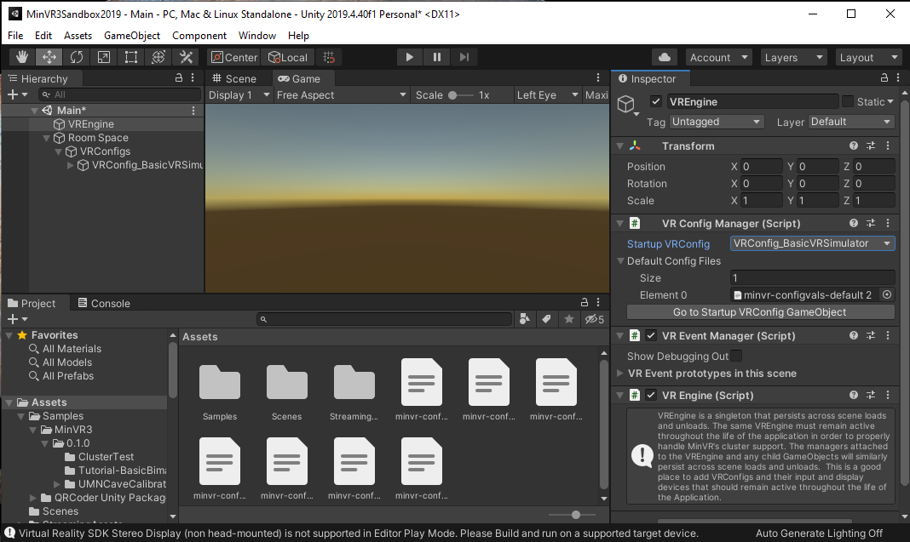
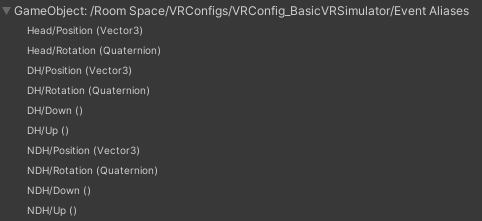
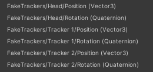
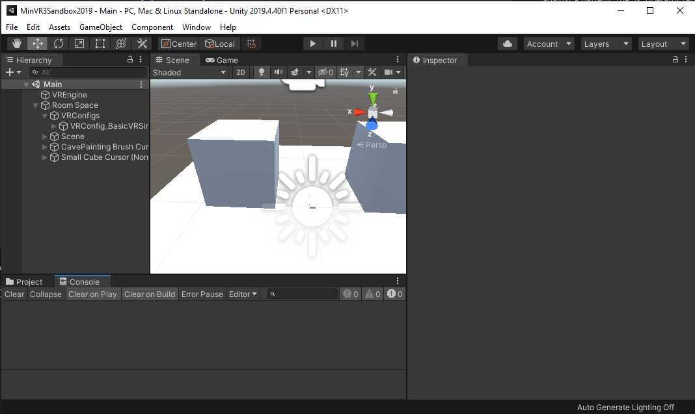
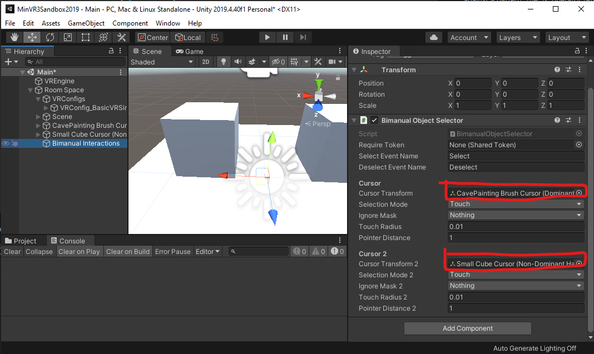
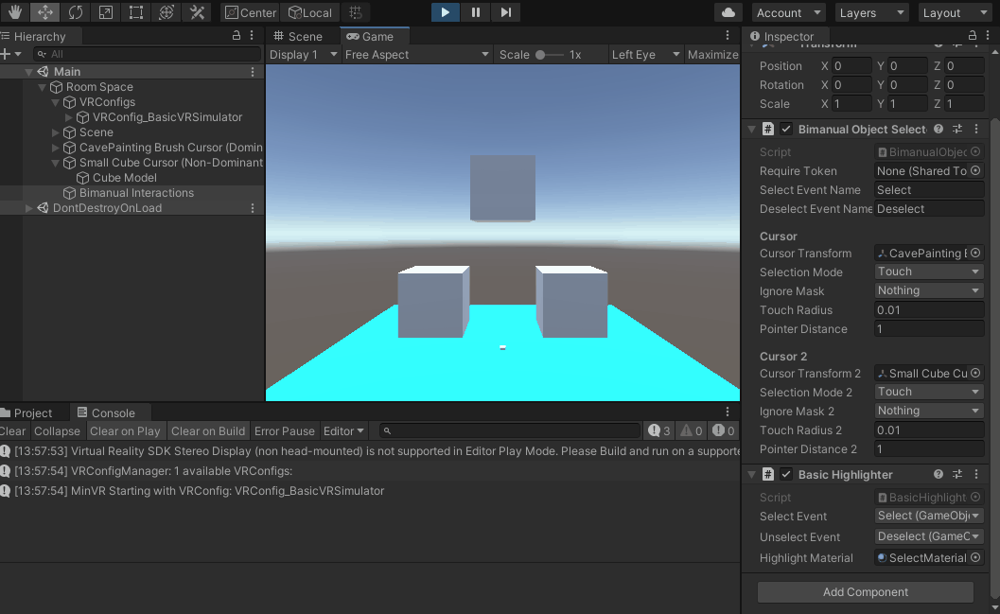
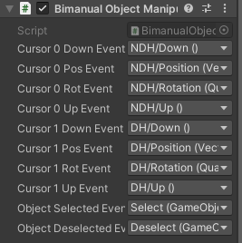
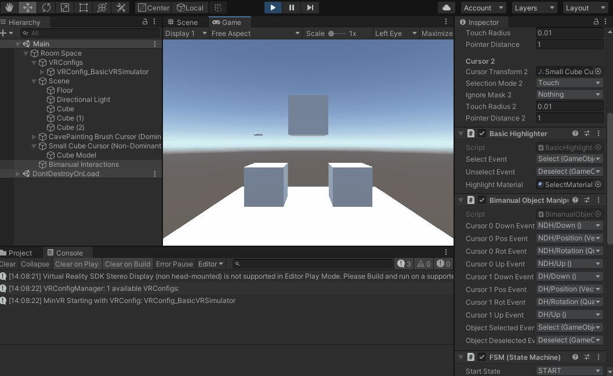

# MinVR3 Tutorial: Basic Bimanual Manipulation

In this page, we'll go over a brief tutorial for using MinVR3 to create a
portable app that enables a user to translate, rotate, and scale an object using
MinVR3 events across multiple devices and build targets. In the course of this
tutorial, we will cover basic terminology of MinVR3 (VREvents, VRConfigs, and
more), as well as how to use the building blocks provided in this library.

## 0. Prerequisites

This tutorial assumes a working knowledge of the Unity game engine, C#
scripting, and git version control.

It also assumes you have [installed the MinVR3 Package](./02-install.md).

## 1. Setting up a MinVR3 Scene

The two key "root" gameobjects for any MinVR3 scene are the VREngine and the
Room Space. The VREngine is the main "guts" of MinVR3 that makes it all tick;
this GameObject is a singleton and persists when new scenes are loaded. The Room
Space gameobject represents the "Room Space" relative to the app's user(s). Read
more about coordinate spaces in the [Coordinate Spaces](./10-vr-coord-spaces.md)
chapter of the manual.

Let's start by creating a blank scene in Unity: create a new scene and delete
any objects (cameras, lights, etc) that show up by default. Then open the MinVR3
Menu and create the Room Space Origin and VREngine (*GameObject > MinVR >
Getting Started > Create "VREngine" and "Room Space Origin" GameObjects*).

After adding these GameObjects, the scene looks like this:

Now, let's make the scene a little more exciting! Add a few 3D objects to the
scene and scale them / rotate them however you wish; add these objects in the
Room Space. Just make sure you have at least one cube with a box collider
attached and one light in the scene. Our tutorial scene looks like this:

## 2. Adding your first VRConfig

Now, that's obviously not very exciting since there are no input or output
devices in the scene yet. Let's fix that by adding our first **VRConfig**: a
configuration of input and output devices for specific hardware setup. Peruse
the already-existing VRConfigs at *GameObject > MinVR > VRConfig* - you'll
notice there are lots of them!

In the scene, generally VRConfigs should be a child of the "Room Space"
gameobject - after all, the user is providing input and receiving output in this
space. As a general rule of thumb, we can create a GameObject named "VRConfigs"
underneath the Room Space gameobject and add all of the VRConfigs as children.

Now, let's create the first VRConfig: a basic VR simulator! This simulator
enables us to develop applications without having any specialized hardware
present - it uses the keyboard and mouse to emulate spatial interactions like
head tracking, and bimanual (two-handed) input devices.

Click on the VRConfigs GameObject you created underneath Room Space, then go to
*GameObject > MinVR > VRConfigs > VRConfig_BasicVRSimulator*.

Select the VREngine GameObject and set the "Startup VRConfig" under the VR
Config Manager to the BasicVRSimulator you just created.

At the end of this section your scene should look like this:

## 3. Adding some interactivity with VREvents

The core of MinVR3 interactivity is based on the concept of [VREvents](./12-vrevents.md).

With the VR simulator VRConfig we just added to the scene, a number of new
VREvent types have been made available in the scene. Select the VREngine
GameObject and twirl down the "VR Event prototypes in this scene" section, and
twirl down any of the GameObjects listed to see what VREvents it can produce.
For example, the Event Aliases GameObject produces `Head/Position` and
`Head/Rotation`, which represent the head tracking position and rotation,
respectively. Notice also under the Input Devices GameObject that
`FakeTrackers/Head/Position` and `FakeTrackers/Head/Rotation` are listed here.

What's up with this multiple `Head`s thing?

In general, it's best to provide a layer of separation between the raw input (in
this case, `FakeTrackers/Head`) and the application level meaning (`Head`). This
makes it possible to handle different input devices and have them control the
same part of the application under different VRConfigs. For example, under the
VR Simulator, head tracking data is supplied by mouse and keyboard, whereas on
the Oculus Quest the head tracking is supplied by UnityXR.

So, long story short: create a series of VREvent Aliases to rename (or rename +
clone) your events so they have a canonical, application-level meaning and
maintain this separately from the incoming, raw input device data.

With this in mind, let's add some interactivity to the scene now with VREvents!
MinVR has several powerful tools that can be used to create spatial
interactions, this tutorial just shows one of the many possibilities. The key
building blocks for adding a simple bimanual interaction (e.g., grabbing with a
button press) are as follows:

- Defining the VREvents for both hands (already done above - see VREvents `DH/*`
and `NDH/*`: these are the position and rotation events for the Dominant and
Non-Dominant hands).
- Adding cursors to the scene to show each hand
- Adding required scripts
    - Bimanual object selector
    - Bounds highlighter
    - Bimanual object manipulator

### Adding Cursors

MinVR3 has a couple handy cursors that already exist. You can add them to the
scene under Room Space by going to *GameObject > MinVR Interaction > Cursors*.
Add one for the Dominant and Non-Dominant hands.

Here we've added a CavePainting brush and a Small Cube Cursor. We rescaled the Brush Model in the CavePainting to be smaller (0.1).

### Adding required scripts

The Bimanual Object Selector enables us to select objects with one or both hands.

1. Create a new GameObject (in Room Space) named "Bimanual Interactions"
2. Add a new Bimanual Object Selector component to the GameObject
3. Drag and drop / select the cursors you added in the previous section to the
"Cursor Transform" and "Cursor Transform 2" of the Bimanual Object Selector
script.

Now, VREvents "Select" and "Deselect" will be fired every time either cursor
comes close to an object with a collider (any collider).

To visualize selections, we can add a Basic Highlighter component to the
Bimanual Interactions GameObject.

In your project, create a new Material and make it a memorable color, then drag
and drop this material into the "Highlight Material" slot for the Basic
Highlighter. Choose the Select and Deselect events too.

When you press play, your scene should now behave something like this:

(use 1 and 2 keys to switch between DH and NDH tracker)

Lastly, after you've verified selection and highlighting are working correctly,
add a "Bimanual Object Manipulator" component to the Bimanual Interactions
GameObject.

Set the event slots as follows (this enables the script to react to VREvents
when the DH and NDH move, rotate, or have buttons pressed, or an object is
selected):

Now, when you press play, you should be able to move the objects in the scene around, rotate them, and scale them:

Okay, that's it for the basics! Now, it's time to make our app portable between devices.

## 4. Adding a MinVR3 Plugin

So far, we've only used input from the keyboard and mouse. But, what if we
wanted to use a spatial tracker, touch screen, or other custom input device?
MinVR has us covered for this. In this section, we will add a [MinVR3
Plugin](./03-plugin-packages.md) to connect to Virtual Reality Peripheral
Network (VRPN) devices - this will enable us to interface with the lab's
high-resolution optical tracking system (OptiTrack Tracking Tools / Motive).

TODO

## 5. Adding more VRConfigs

The real power of MinVR3 is that it enables your app to support multiple target
platforms without changing the core structure of your app. This is achieved
through VRConfigs.

We've already added one VRConfig to the scene: the Basic VR Simulator. Now,
let's say we want to deploy our app to the CAVE.

TODO